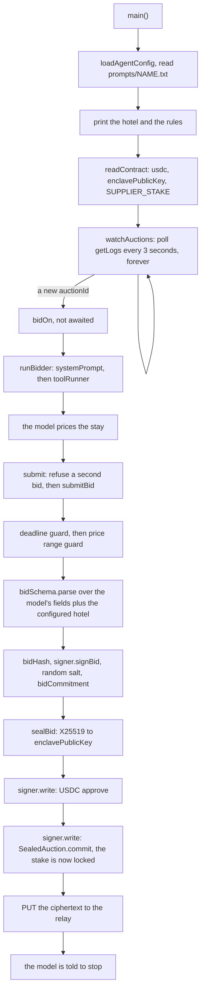

# @perdiem/agents

Three supplier agents, one codebase, one configuration and one prompt each. Each agent is a Claude
tool-calling loop: an operator starts it with one sentence of business rules, the model reads the
auction terms off the chain, applies the rules, and submits exactly one bid.

The model derives two things from the auction rather than the prompt: the number of nights, and the
season. That is what the model is for. See `docs/adr/0007-supplier-agents-decide-with-a-model.md`.

| Agent                    | Hotel                      | Stars | Demo price |
| ------------------------ | -------------------------- | ----- | ---------- |
| `hotel-astoria-agent`    | Hotel Astoria - Astotel    | 3     | 330        |
| `victoria-palace-agent`  | Victoria Palace Hotel      | 4     | 400        |
| `grands-voyageurs-agent` | Hôtel Des Grands Voyageurs | 4     | 440        |

## The one tool

`submitBid` does everything in Node, in one call: validate the fields, check the price range, hash
the bid, sign it, draw a salt, compute the commitment, seal the envelope, approve and commit the
stake on chain, and post the ciphertext to the relay. Those steps have one legal order, so they are
one tool. Split apart, a model can seal without committing, commit without posting, or commit twice.

The model never sees a hash, a salt, a signature or a private key. A model that wrote its own
hashing would produce a commitment the enclave drops, and that drop is silent.

The model decides the price, the refundable and breakfast terms, the room type and the room count.
The hotel is not a decision: it is in the configuration, checked against the supplier's catalogue
before the agent runs, and attached to every bid. So the model cannot bid a room this supplier does
not sell.

An agent never books. It seals its own booking credentials into the envelope and the enclave books
with them, so the agent has nothing to do after the bid deadline.

## What happens in one run

An agent is a long-running process. It starts once, listens to `SealedAuction`, and bids on every
auction that opens while it runs. `SIGINT` or `SIGTERM` stops it.



Every box below `submit` is Node, in that order. The model sees the first box and the last one.

The watcher never awaits a bid. One auction that takes twelve model turns must not hide the next
one, and one auction that fails must not stop the agent bidding on anything else. An auction fires
once: a rescan of the same block is ignored. A failed read of the chain is logged and retried on the
next tick, because a watcher that exits on a dropped connection is a supplier that silently stops
bidding.

## The price range

Each configuration carries a `priceRange` in USDC minor units, and `submitBid` refuses a price
outside it and names the range in the error. The model corrects on the next turn. The range is
configuration, not a hidden rule.

Each range covers the rate its prompt gives for a one or two night stay outside winter, which is the
only auction the demo runs. A three night or winter auction prices below the range, and `submitBid`
refuses it. The cost of that: the ranges are a guard on one auction, not a full rate card.

## Wallets

Each agent signs with one signer behind a three-member interface: the address, an EIP-712 signature
over the `Bid` type, and a contract write. Today the only implementation is `createLocalSigner`, a
viem externally owned account reading `AGENT_PRIVATE_KEY`. `createCircleAgentSigner` is the demo
path and is not written yet.

The bid signature and the chain calls come from the same address, because `commit` pulls the stake
from the caller and the enclave checks that the bid's signer staked.

## Commands

Run from the repository root, after `pnpm install`.

```sh
pnpm --filter @perdiem/agents test                          # tsx --test, no network
pnpm --filter @perdiem/agents typecheck                     # tsc --noEmit
pnpm --filter @perdiem/agents start grands-voyageurs-agent  # one agent
pnpm --filter @perdiem/agents check:prices                  # calls the model, costs money
```

No test calls a model or a hotel supplier. `check:prices` does: it runs all three agents against the
reference auction, prints what each one bid, and exits non-zero on a price the demo table does not
expect. Run it after any change to a prompt, a price range or the system prompt.
