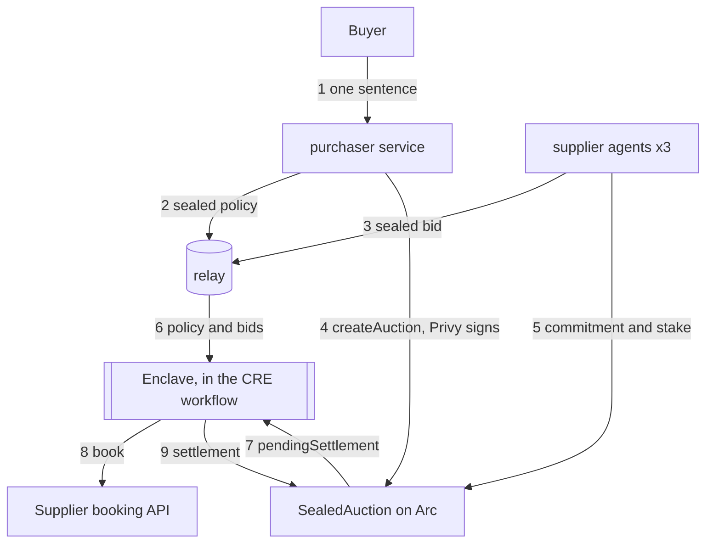
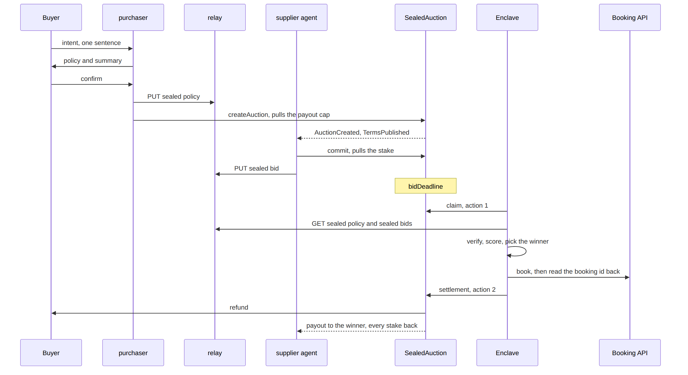
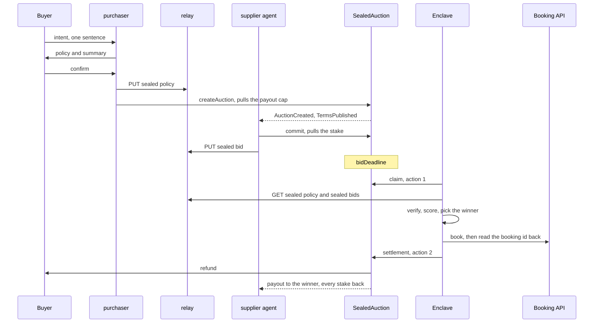

# Architecture

Who talks to whom, and in what order. The protocol itself is in `docs/spec.md`.

## Components

- The booking arrow runs from the Enclave, not from an agent. An agent stops at `bidDeadline`.
- The relay stores bytes. It holds no key, so it never reads a policy or a bid.
- Only the Enclave holds the enclave private key, so only the Enclave opens the sealed policy and
  the sealed bids.

## Order

