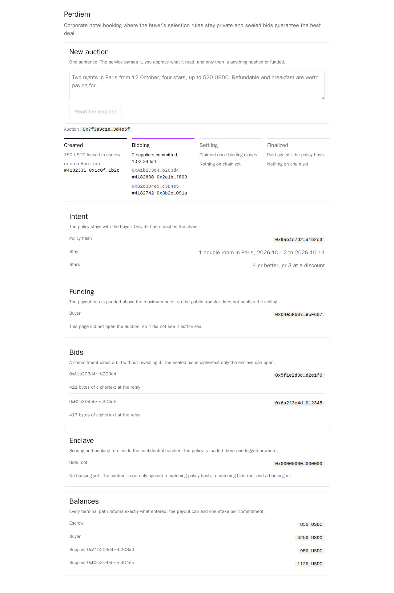
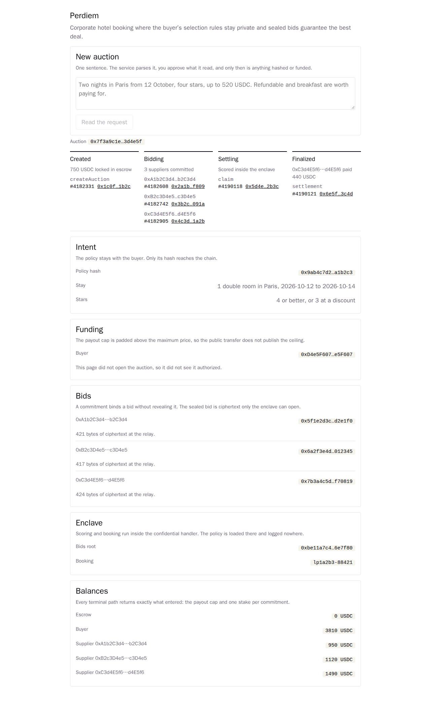

# Trim the panels and finish the look

Status: resolved Type: task Blocked by: 03, 04, 05

With the stepper, the transaction rows and the balances in place, several facts appear twice: the
state, both deadlines, the payout cap, the winner, the payout and every transaction hash.

Every fact appears once. The panels keep what only they can say: the policy hash, the public
requirements, the buyer, the commitment hashes, the ciphertext sizes, the bids root and the booking
id.

Then one pass over the whole page against `docs/scratch/ui/spec.md`, with the auction in each of its
states. The page is minimal: fewer lines, more space, one accent. It is not sparse: no state leaves
a viewer wondering what is happening or what happens next.

## Acceptance criteria

- [ ] No fact renders in two places.
- [ ] The panels keep the policy hash, the requirements, the commitments, the ciphertext sizes, the
      bids root and the booking id.
- [ ] The stepper stays visible while the panels are read, at the resolution the video records at.
- [ ] The page obeys every rule in the spec, checked in `Created`, `Bidding`, `Settling`,
      `Finalized` and `Timeout`, in both colour schemes.
- [ ] A screenshot of `Bidding` and one of `Finalized` are attached to this ticket.
- [ ] `ui/README.md` describes the page as it now is.

## Screenshots

## Comments
